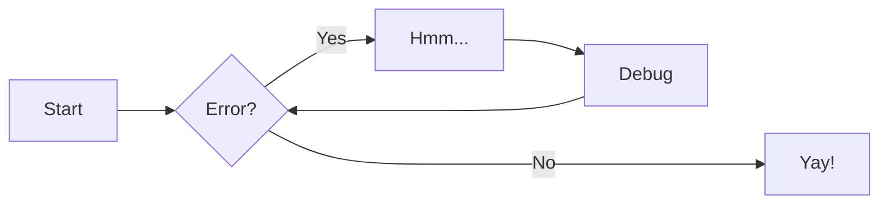

# Writing docs
The documentation of Open-source-server-implementation-of-the-HLA4-Federate-Protocol (the documentation
you're reading right now) is made using [MkDocs](https://www.mkdocs.org). For advanced features, check the MkDocs
documentation.

## Quick-start

You can install MkDocs via `pip` to render the documentation locally. You don't have to however, the latest
documentation will be automatically rendered via CI. If you do want a local preview of what you're writing, run
`mkdocs serve`

## Mermaid.js
MkDocs has been configured to support rendering mermaid.js graphs:

## Drawio
Mkdocs has been configured to allow importing drawio files:
