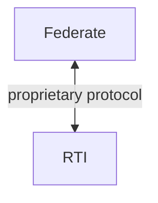
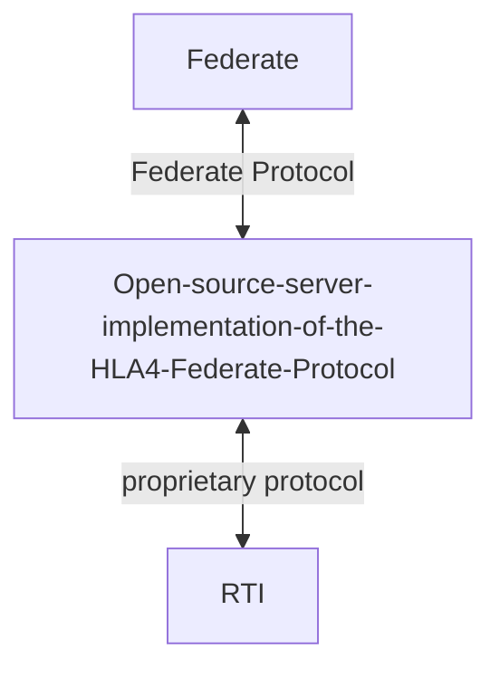
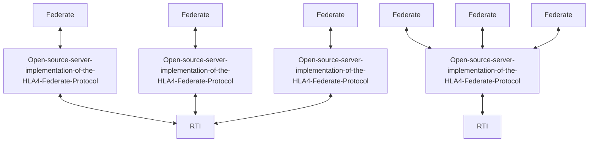

# Getting started

## What is Open-source-server-implementation-of-the-HLA4-Federate-Protocol for?
As part of the HLA4 spec, a new Federate Protocol was added. This is a standardized protocol for communicating with the
RTI. Having such a standardized protocol has a number of advantages, for example the protocol can be implemented in any
protocol which supports TCP or Websockets.

The Open-source-server-implementation-of-the-HLA4-Federate-Protocol project attempts to help adoption of the Federate
Protocol. It makes use of the "regular" way of connecting to an RTI (via an SDK), and exposes a Federate Protocol
server. It can be used to give Federate Protocol support to an RTI that does not normally support it.

Without Open-source-server-implementation-of-the-HLA4-Federate-Protocol:

With Open-source-server-implementation-of-the-HLA4-Federate-Protocol:

When using multiple federates, you can choose if you want each one to have their own instance, or share one
across the board

## Running the server (with  the jar file)
The server can be run using the provided jar file, which can be
downloaded from [Github releases](https://github.com/HLA4FP-Server-Project/Open-source-server-implementation-of-the-HLA4-Federate-Protocol/releases).
When running the jar, please include your RTI's SDK in the classpath.

## Valid RTI's
The Open-source-server-implementation-of-the-HLA4-Federate-Protocol supports any RTI which supports HLA4. It relies
on the RTI's Java SDK. Please refer to your RTI's documentation, it should mention a jar file which you are to
include in any Java-based federates. This is the jar file which Open-source-server-implementation-of-the-HLA4-Federate-Protocol
requires.